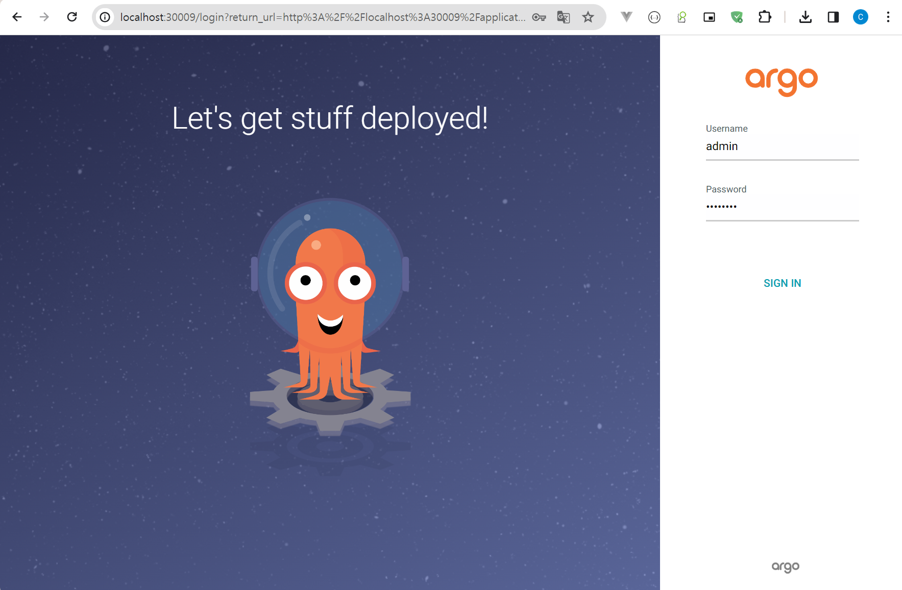
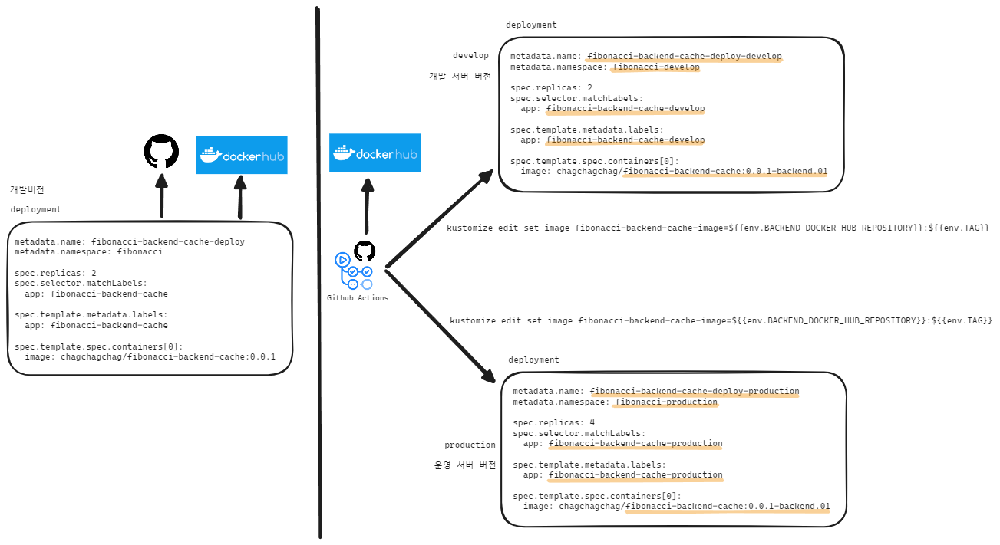

## ArgoCD Deploy Project


## 필요 개발환경 

### 1\) Docker


### 2\) kind 클러스터

[쿠버네티스 로컬 개발환경으로 Kind 를 써보자](https://github.com/chagchagchag/eks-k8s-docker-study-archive/blob/main/kind-cluster/%EC%BF%A0%EB%B2%84%EB%84%A4%ED%8B%B0%EC%8A%A4%20%EB%A1%9C%EC%BB%AC%20%EA%B0%9C%EB%B0%9C%20%ED%99%98%EA%B2%BD%EC%9C%BC%EB%A1%9C%20Kind%20%EB%A5%BC%20%EC%8D%A8%EB%B3%B4%EC%9E%90.md) 를 참고해주셨으면 합니다.

<br>


### 3.1\) 로컬 ArgoCD 클러스터 셋업 

이 예제는 Kind Cluster 내에서 ArgoCD 배포과정을 진행합니다. EKS 에서 진행해도 되고 별도의 개발용도의 ArgoCD 서버가 있다면 그곳에서 진행해도 되고, 로컬 환경을 따로 구축해야 한다면 Kind Cluster 에 ArgoCD 를 구축하셔야 합니다. <br>

로컬 개발환경 또는 내부 개발용도 네트워크에서 ArgoCD 클러스터를 구동해야 한다면 Kind 클러스터에서 수행하시는 것을 추천드립니다. kind 클러스터가 설치되어 있다면 아래의명령을 수행하시는 것으로 ArgoCD 클러스터 설치를 완료하실 수 있습니다.<br>

```bash
$ cd argocd-kind-cluster/
$ source setup.sh
```

<br>

> EKS 가 아니더라도 내부망에 이렇게 Kind 클러스터를 이용해서 ArgoCD 를 구축하셔도 됩니다. 배포와 빌드를 위해 사용하는 것이기에 비용문제가 있다면 이렇게 해도 상관은 없을 듯 합니다.

<bR>


[localhost:30009](http://localhost:30009) 로 접속을 해보시면 아래와 같은 화면이 나타납니다.



<br>

설치 시 기본으로 제공되는 관리자의 user id 는 `admin` 입니다.

`admin` 사용자에 대한 비밀번호는 아래의 명령으로 확인 가능합니다.

```bash
$ kubectl -n argocd get secret argocd-initial-admin-secret -o jsonpath="{.data.password}" | base64 -d

BqKNJcor-47HEtLV
```

<br>


## 3.2\) EKS 에서 ArgoCD 클러스터

만약 EKS 에서 구동을 하셔야 겠다면... [github.com/chagchagchag/eks-k8s-docker-study-archive/eks-by-argocd](https://github.com/chagchagchag/eks-k8s-docker-study-archive/tree/main/eks-by-argocd) 를 참고하시면 될 듯 합니다.

<br>


## 사람마다 다른 ArgoCD 에 대한 관점

개발자가 이런거 왜 하냐는 질문을 굉장히 많이 받는데, 주로 나이 지긋하신 개발자분들이 이런 질문을 많이하신 것 같습니다.<br>

2년 전 스타트업에서 일을 해보니 실제로 개발을 하면서 젠킨스 구축부터 그라파나 도입, 레빗 엠큐 설치 까지 직접 손수 했던 일이 꽤 많았습니다. 인프라 팀에서 따로 데브옵스를 하고 있었음에도 그렇게 해야 했습니다. 

> 물론 그 당시 인프라팀이 비트코인 가스 채굴 같은 일만 하면서 일에서 손을 떼고 있는 분들이 두명 존재하던... 양심 불량, 근무태만 조직이었다는 것 역시 감안해야 하긴 했습니다.<br>

<Br>

이런 이유도 있었지만, 스타트업에서 개발을 하다보니, 단순히 개발을 하는 엔지니어 관점이 아닌 제품을 개발하는 담당자 관점에서 생각하게 되었고, 제품에 대해 애정을 갖고 개발을 진행해왔던 것 같습니다.<br>

ArgoCD 를 사용하는 이유는 현재 개발한 내 기능이 무중단 배포시 Rolling Update 가 아닌 카나리 배포 또는 Blue/Green 배포를 수행해야 하는지를 판단해서 적절하게 배포 전략을 채택해야 하는 경우가 있습니다.<br>

이런 경우에 ArgoCD 의 Rollout 을 이용해서 원하는 무중단 배포 방식을 적절하게 선택해서 배포할 수 있습니다.<br>

물론 개발 버전이라면 이렇게까지 ArgoCD 까지 구축할 필요는 없는데, 멜론 운영업무 시절부터 스타트업에서 증권서비스 개발 업무까지 경험해보면서 단순히 코드 커밋하고 푸시해서 개발환경, 개발서버에서 뭔가가 동작한다고 착각하는 나태함과 오만함 자체가 꽤 큰 실수라는 걸 깨달았던 것 같습니다. <br>

<br>


## draft

### kustomize

왼쪽은 로컬 개발환경

오른쪽은 개발서버, 운영서버 버전.



<br>

