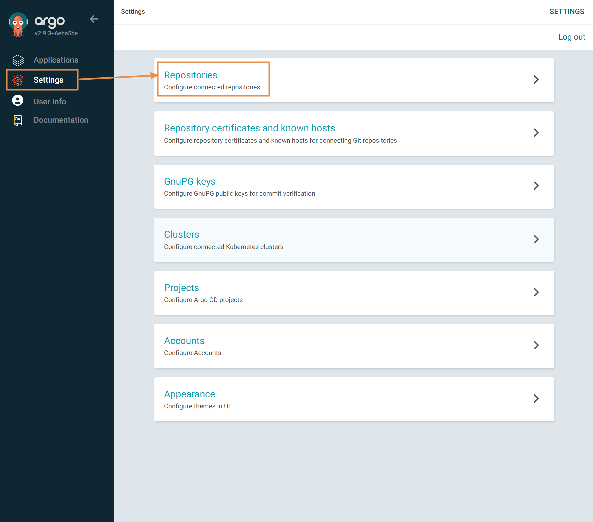
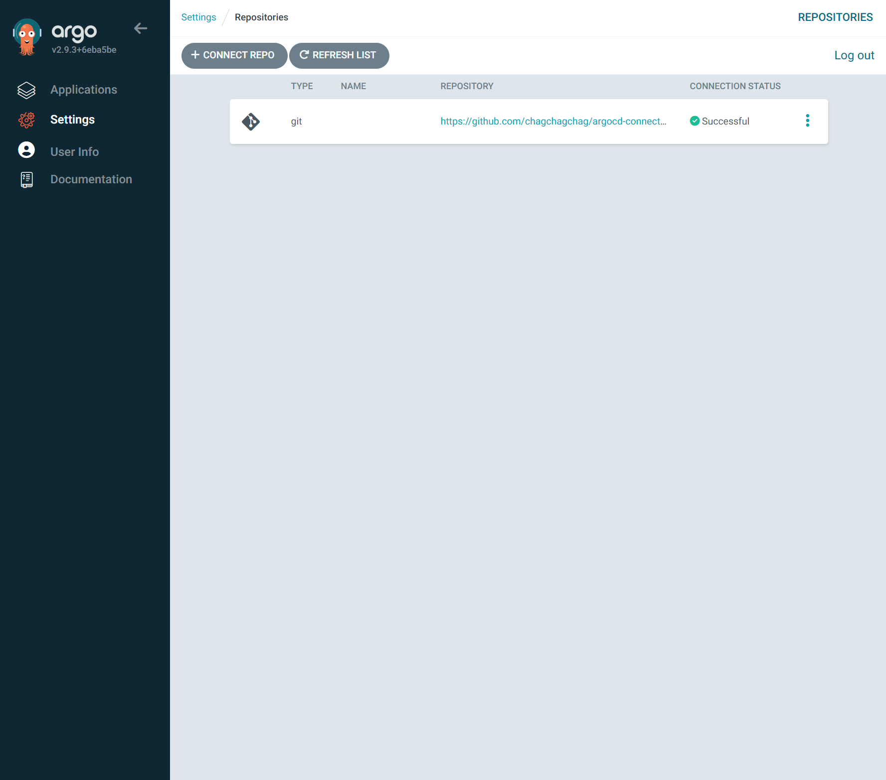

## ArgoCd Project, Application (0) - Github Token 등록

## github token 생성

Github Profile → Settings 

좌측 사이드바 내의 Developer Settings

 

이동한 페이지 내의 좌측 사이드바 에서는 Personal access tokens → Tokens(classic) 을 클릭

 

Generate new token → Generate new token (classic) 클릭

 

Token 에 대한 이름을 지정해주고 권한은 repo 에 대한 권한들을 부여해준다.

더 필요한 권한이 있다면 더 부여해준다.

 

이후 `Generate Token` 을 클릭해서 다음 페이지로 넘어간다.

액세스 토큰 생성 결과를 보여주는 페이지다. 액세스 토큰 문자열을 복사해서 따로 메모장 등에 보관해둔다.

## ArgoCD 에 Github Repository 추가 (연동 확인 용도)

Settings → Repositories 클릭

 

+CONNECT REPO 버튼 클릭

 

이어서 나타난 페이지에서는 아래와 같이 작성해준다.

 

username 은 github 계정 명이다.

Password 는 github token 문자열이다. 패스워드로 사용되는 github token 은 이 문서의 처음에 생성해둔 토큰 문자열을 복사해서 붙여넣어주면 된다. 또는 이미 생성해둔 토큰이나 사용하기를 원하는 토큰이 이미 있다면 그 토큰을 사용하면 된다.

 

## Cluster 추가

접속 현황을 보여주는 페이지다.

 

## ArgoCd 에 application 추가 (연동 확인 용도)

 

Application Name, Project Name 추가

 

Source, Destination 에 각각 내용을 입력한 후 Create 버튼을 눌러서 마무리한다.

Cluster URL 입력 폼을 클릭하면 자동으로 `https://kubernetes.default.svc` 가 추천으로 나타나는데, 이 것을 그대로 선택하면 된다.

연동이 완료된 모습

