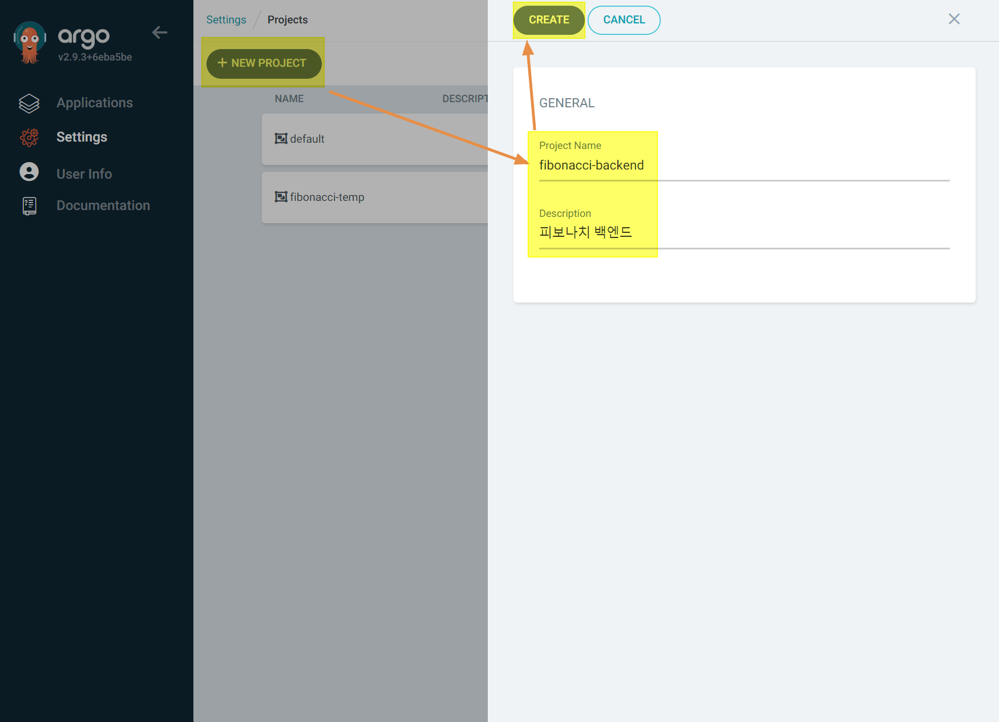
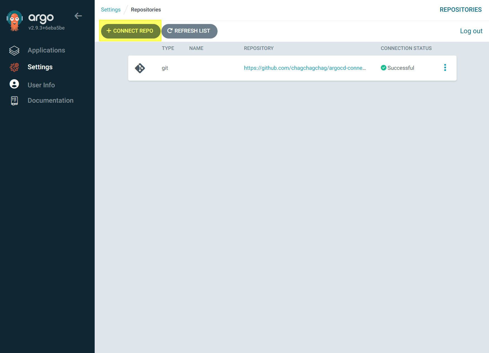
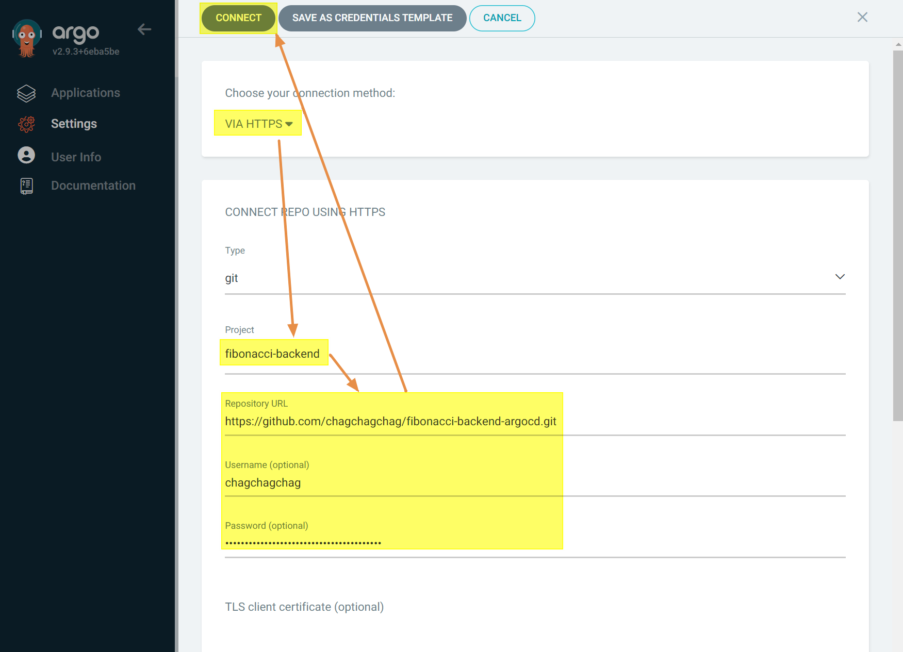
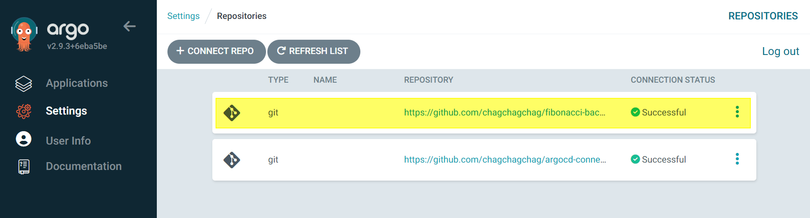
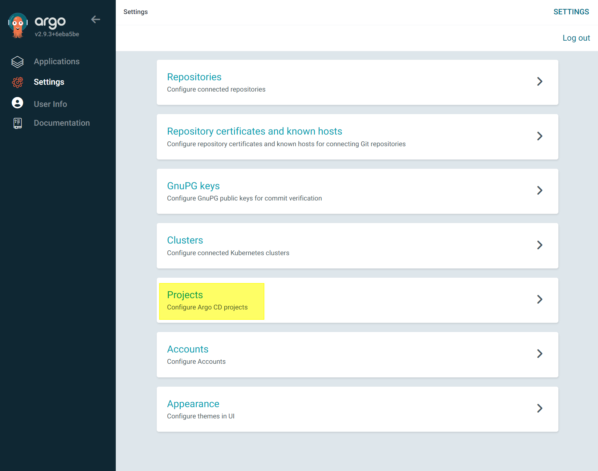
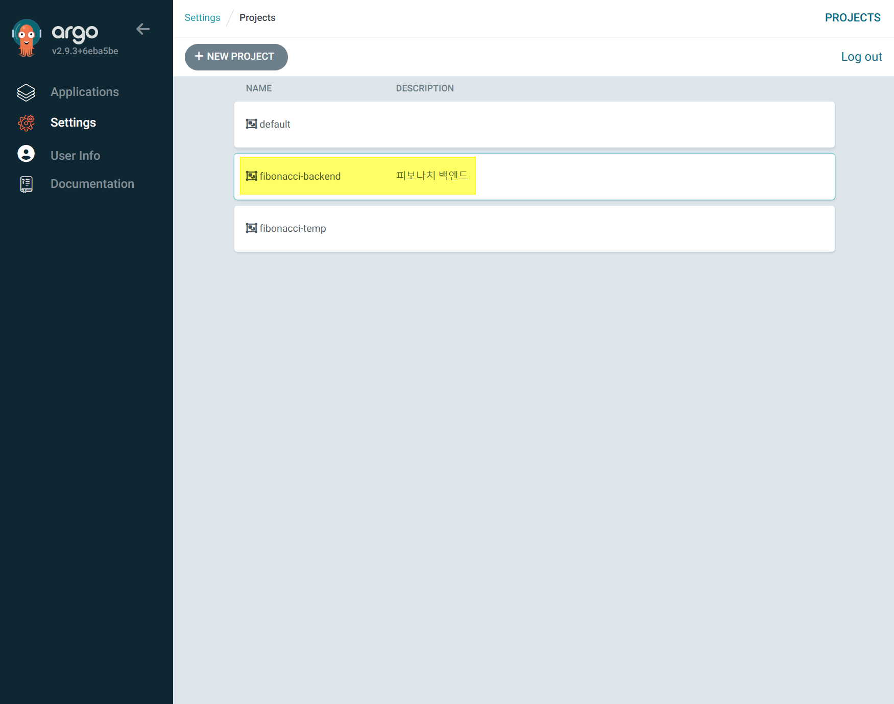
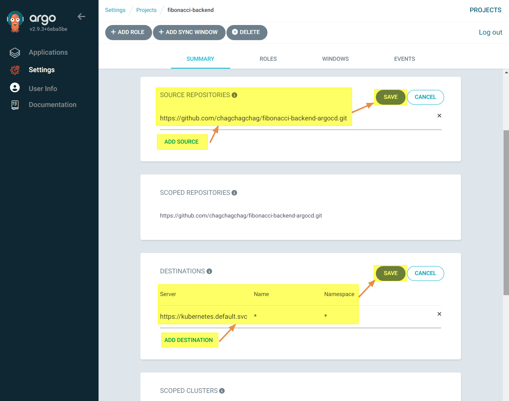

## ArgoCD Project, Application (2) - Project 생성, Github Repository 등록, Project 에 Github Repository 연결

## ArgoCD 에 프로젝트 생성

## ArgoCD 에 배포 용도의 Repository 등록

 

 

 

## ArgoCD 프로젝트 내에 Repository 지정

 

 

 

